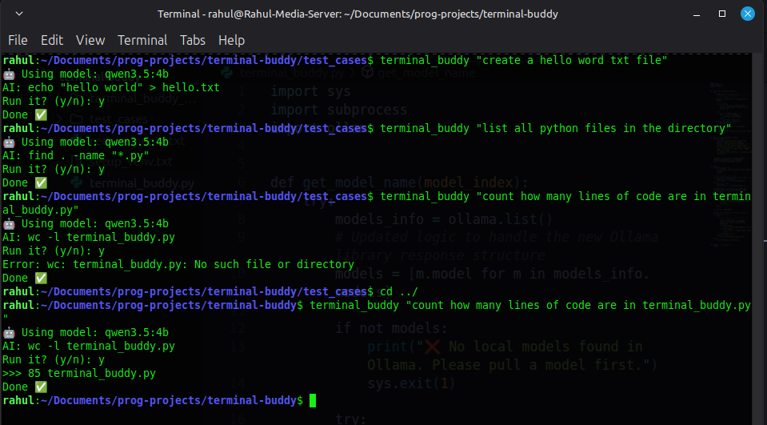

# Terminal Buddy

Terminal Buddy is a specialized Python-based command-line tool that leverages local Large Language Models (LLMs) via Ollama to convert plain English instructions into Bash commands. It provides a straightforward interface to generate and safely execute shell scripts.

## Features

- Converts natural English prompts into executable Bash commands.
- Allows selection among different local language models available in your Ollama installation.
- Built-in security restrictions to block any commands involving 'sudo' or administrative privileges.
- Prompts for user confirmation before executing any generated command.

## Prerequisites

- Python 3.x
- Ollama installed and running locally.
- At least one model pulled in Ollama (e.g., 'ollama pull llama3').

## Setup

1. Set up a virtual environment:
   ```bash
   python -m venv terminal_buddy_venv
   source terminal_buddy_venv/bin/activate
   ```

2. Install the necessary dependencies:
   ```bash
   pip install -r requirements.txt
   ```

## Usage

Execute the script by passing your prompt as an argument. You can also specify an optional model index.

**Basic Usage:**
```bash
python terminal_buddy.py "list all text files in the current directory"
```

**Specifying a Model Index:**
```bash
python terminal_buddy.py 2 "find all python files modified in the last 7 days"
```

The application will present the generated command and prompt you for confirmation before execution.

## Output Example


